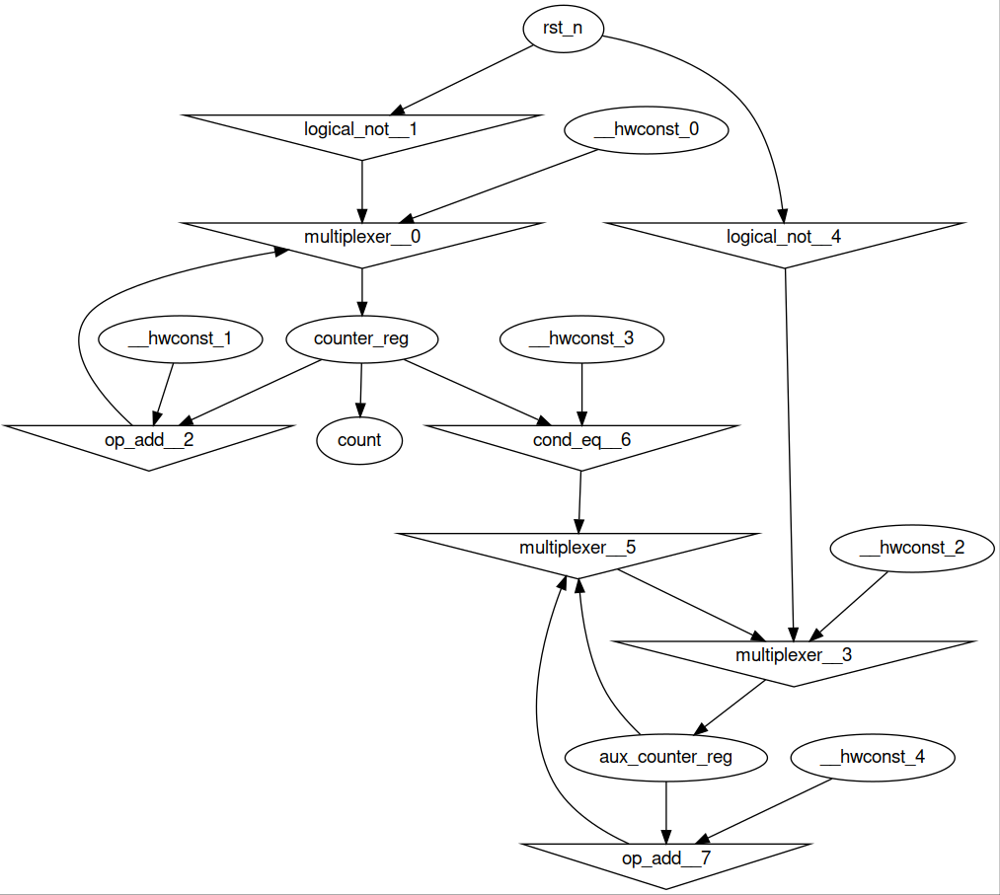
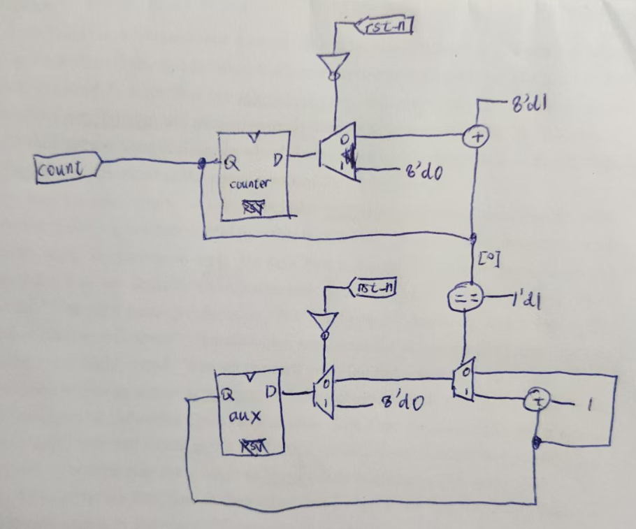

# Veripython: another implementation for Verilator with Python target

源语言：Verilog，目标语言：LLVM 与 Python。

Verilog 是一种硬件描述语言（HDL），与传统的通用编程语言（如 C、Python）有本质上的区别：

- 硬件描述：Verilog 用于描述电路而非软件逻辑，它表达的是硬件结构和行为。代码往往包含并行语义，而通用编程语言通常是顺序执行的。
- 时间和时序逻辑：Verilog 使用时钟和时序语句（如 always 块和 @(posedge clk) 等）来描述时序电路的行为。
通用编程语言没有时钟概念，也不会有类似的时序控制语句。
- 并行执行：Verilog 的描述是并行执行的，尤其是多个 always 块和模块实例之间是并发执行的，而传统编程语言往往依赖于函数调用和循环来进行顺序计算。
- 模块化设计：Verilog 有模块（module）这一关键语法结构，用于描述硬件模块，并可以嵌套和实例化模块，这是其主要的结构化特征。而通用编程语言通常使用函数和类来进行模块化。

VeriPython 是一个以 `Python` 为目标语言的 `Verilator` 实现。

Verilator 是一个开源的高性能 Verilog 和 SystemVerilog 模拟器，主要用于将硬件描述语言（HDL）编写的设计转换为可在软件中运行的代码，
从而对硬件设计进行仿真和验证。与传统的硬件仿真工具（比如 ModelSim、VCS 等）不同，Verilator 并不直接进行时序仿真，而是将 Verilog 
或 SystemVerilog 代码转换为 C++ 或 SystemC 代码，然后通过编译生成可执行文件来模拟硬件行为。这样做的好处是，仿真速度非常快，可以在
标准的计算机上运行，而不需要专用的硬件仿真设备。传统的波形工具通常用于查看电路的时序波形，以帮助调试设计中 的信号变化，
而 Verilator 的目标更多是将硬件设计转化为软件可运行的模型，从而快速验证设计的功能是否正确。在许多场景下，Verilator 可以
与其他工具结合使用，进行更详细的时序分析和波形查看，但它本身不生成复杂的波形图，而是侧重于提供高效的仿真性能，适用于大规模的硬件设计验证
和功能验证。

作为编译原理课程的大作业，VeriPython 将实现一个 Verilog Parser（进行词法分析、语法分析）、电路前向传播计算图生成器（语义检查与电路生成）、
MLIR (LLVM) 生成器与 Arcilator (CIRCT (LLVM)) 中的 Python 后端。为了留出更多时间供我们探索编译原理的核心知识，我们简化了语言支持，
我们只解析了 Verilog 语法的子集，并且只计划支持可综合的代码，也就是 Verilog 的 Initial 等不可综合的代码块是不被支持的，允许我们专注于
Verilog 编译器的核心任务：生成正确的硬件电路，而不是处理复杂的仿真语法。

本项目不仅符合编译原理课程的要求（包括词法分析、语法分析、IR 生成和目标代码生成），还会深入探索硬件描述语言的编译过程，
这对编译器设计的理解具有很好的拓展性和研究价值。它能够结合我们对硬件与编译器的兴趣，展示出我们对这两个领域的交叉应用能力。

小组分工如下：

- 词法分析、测试与电路可视化：杨憬晗
- 语法分析与 AST：徐浩然
- 语义检查与组合逻辑电路生成：杨之凡
- 语法分析、电路生成、时序逻辑与 LLVM：赵涵远

## 编译与运行说明

本项目运行在 Linux 环境。依赖有：

- `cmake` >= 3.22
- `flex`
- `gcc` >= 11

编译步骤如下：
```bash
# 编译，代码路径不能出现中文
$ mkdir build && cd build
$ cmake .. -DRELEASE_CODE_MODE=ON
$ make -j

# exe 目录内提供 veripython 的二进制（在 Ubuntu 22.04 下编译），
# 如果测试机器的c库满足条件，或者系统大于22.04，可以直接执行
$ veripython ../tests/verilog_srcs/full_adder.v -o full_adder.json -ast -vis
```

目前提交的代码仅包含前端部分。支持的参数有：
- `-o`：指定输出文件名
- `-ast`：将语法分析树以`json`格式进行输出
- `-vis`：使用`graphviz`生成 HDL 的 RTL 视图到 `rtl_view.png`中
- `-token`：仅生成 `token` 流

## 实现

### 词法分析

为了解析 Verilog 的语法，我们使用了 `flex` （fast lexical analyzer generator，快速词法分析产生器）进行词法分析。
`flex` 应用广泛，从 `linux` 内核、`bash shell` 到 `MySQL` 的 `SQL` 解析器，都有 `flex` 的身影。
`flex` 自带最长匹配与最早匹配原则，非常便于进行一门语言的词法分析。
我们在 `verilog.l` 中定义了词法规则，使用具体的字符串与正则表达式（pcre2 规范）进行 token 的匹配，
一旦匹配到 `token`，就将对应的 `token id` 作为 `yylex` 函数的返回值。这些 `token id` 定义于 `Lexer.h` 中。

根据开发规范，`flex` 生成的 `lex.yy.c` 将在编译时链接到我们的程序中，并通过调用 `yylex` 函数获取下一个 token 的 id。
为了便于在代码中实现前瞻等特性，我还实现了一个 `token buffer`。由 `yylex` 解析出来的 `token` 都会加入 `token buffer` 中，
当 parser 进行前瞻时，直接返回 `token buffer` 的队首，当 parser 进行 eat 时，就 pop 掉队首元素。

### 语法分析

在编写语法分析有关的代码时，尽管已有 ANTLR、bison 等自动语法分析工具可供使用，我们仍然选择了与主流编译器前端相同的策略，也就是
手写递归下降器，这么做的原因如下。

对于电路描述语言，语法规则复杂多变，解析过程往往设计上下文敏感的信息，并且要想让实现具有高效性，就需要在语法分析阶段进行部分的语义检查，
例如在解析非阻塞赋值或者 `assign` 语句时，与其返回一颗语法分析树，不如直接将这一抽象的电路连接加入符号表中。手写递归下降器允许我们处理
一些复杂的语法或者特殊的语言结构，如果使用自动语法分析工具，它们通常要求给出的上下文无关文法非常清晰并且没有歧义，所以我们可能需要手动指定
拓展或者解决冲突，而手写递归下降器允许我们通过回溯或者前瞻更加灵活地处理语法规则。

在处理表达式解析时，相比于定义没有二义性的文法，更为便利的做法是根据运算符优先级进行解析。我们定义了运算符优先级表，根据优先级表，对 `primary`
进行“移入”或者“归约”。`primary` 为表达式中的单元，可以为identifier、常量，也可以为 `5'd3`这样的电路常量，也可以为括号包裹起来的表达式。
我们还修改了 HDL 的运算符优先级解析器，使其支持三元表达式。

```c++
/* 运算符优先级，数值越高越优先 */
std::unordered_map<VeriPythonTokens, int> Parser::operatorPrecedence = {
        {TOKEN_colon,          5},
        {TOKEN_question,       5},
        {TOKEN_logical_and,    20},
        {TOKEN_bitwise_or,     30},
        {TOKEN_bitwise_xor,    40},
        {TOKEN_bitwise_and,    50},
        {TOKEN_cond_eq,        60},
        {TOKEN_cond_ne,        60},
        {TOKEN_cond_lt,        70},
        {TOKEN_cond_le,        70},
        {TOKEN_cond_gt,        70},
        {TOKEN_cond_ge,        70},
        {TOKEN_arith_lshift,   80},
        {TOKEN_logical_lshift, 80},
        {TOKEN_arith_rshift,   80},
        {TOKEN_logical_rshift, 80},
        {TOKEN_op_add,         90},
        {TOKEN_op_sub,         90},
        {TOKEN_op_mod,         100},
        {TOKEN_op_mul,         100},
        {TOKEN_op_div,         100},
        {TOKEN_logical_not,    110},
        {TOKEN_bitwise_not,    110},
};
```

由于 verilog 支持对信号进行切片，例如 `a[3:2]` 就是取 identifier a 的第三根线与第二根线的信号，因此语法分析时也需要对这这一部分解析，
这也再次凸显了递归下降器的优势，只需要前瞻下一个 token 是否为 `[`，如果是，则执行 `parsePortSlicing`，并且将返回值加入电路连接。这一
过程涉及了语法分析也涉及了语义分析。

在设计 AST 时我们充分利用了 C++ 的面向对象特性，在基类中我们定义了虚函数 `toString`。这样只需要执行基类的函数，递归打印子树，
即可输出 AST。在阅读 AST 时，可能会遇到这样的符号：

```json
{
  "nodeType": "identifier__-1_-1",
  "data": "a"
}
```

这里 `identifier__-1_-1` 的 `_-1_-1` 代表的是选中了线束 `a` 的哪几根信号。`_-1_-1` 代表选中所有信号。而

```json
{
  "nodeType": "identifier__3_1",
  "data": "b"
}
```

则代表选中线束 `b` 的第 1 到 3 根信号（从 0 开始）。

### 语义分析与电路生成

在进行语法分析的阶段，我们就已经将电路连接、模块信息等内容加入了符号表内。接下来要做的就是根据电路连接与模块输入输出端口信息生成计算图。该计算图
为一种 DAG （有向无环图），采用事件驱动模型实现了一种前向传播网络。这种数据结构结合了计算图与信号的递归传播特性，十分兼容三态逻辑（0、1和不确定），
十分适用于数字电路模型的描述与仿真。

语法分析在进行解析时，会将解析到的电路连接加入符号表。电路连接是这样一种数据结构，它表示了一组信号的需要传播到的下一个目标，以及这组信号的抽象语法树。
例如
```verilog
assign a = b | c;
```

这一语句对应的电路连接的传播目标就是 `a`，这组信号指的就是 `b | c`。

在语法分析结束后，语义分析将与电路生成同时进行。此时将遍历电路连接。对于上面的例子，`b | c` 对应的 AST 会被递归地解析成电路（计算图）中的组件。例如：

```text
         a
         |
  comb_logic_or__0
 /                \
b                  c
```

`comb_logic_or__0` 就是根据 AST 生成的电路组件，其接受两个输入，并且将它们的信号按位取或。一旦有值从上级前向传播到 `b` 或者 `c`，
`b` 或者 `c` 就会将值继续前向传播到 `comb_logic_or__0`。`comb_logic_or__0` 会保存输入，直到两个输入全都满足后，`comb_logic_or__0`
将计算结果，并且将结果继续传播到 `a`。这里 `comb_logic_or__0` 中的 `__0` 代表的是这是本电路中第 1 个生成的电路组件。

整个电路就是反复地这样操作，将所有抽象的电路连接连接成这样的 DAG，并且可以基于事件驱动模型进行仿真。这一部分的代码位于 `RtlModule.cpp` 的
`RtlModule::buildCircuit` 中。

上面忽略了重要的一点，就是如何将使用 AST 表示的节点转换为 DAG 的电路组件节点。这一过程是通过解析 AST 的 operator 属性完成的。代码
`CombLogics.h` 使用 c++20 的模板功能批量构建了 `CombLogicLogicalOr`（逻辑或） 等能够执行对应计算功能的 `class`，并且编写了一个
工厂函数，根据对应的 operator 属性，生成对应的组合逻辑 `class`。事实上，这里的 operator 就是 `token`。例如有一个 AST：

```test
 token_op_add
/            \
a            b
```

这里，operator 就是 `token_op_add`。`CombLogicFactory::create` 函数会自动根据 `token_op_add`，以 unique_ptr 形式
返回对应的加法器组合逻辑。

### 时序逻辑与LLVM

WIP。不在前端作业提交的范围内。

## 运行结果

电路源代码：

```verilog
module counter (
    input wire clk,
    input wire rst_n,
    output [7:0] count
);

reg [7:0] counter_reg;
reg [7:0] aux_counter_reg;
assign count = counter_reg;

always @(posedge clk) begin
    if (!rst_n) begin
        counter_reg <= 8'd0;
        aux_counter_reg <= 8'd0;
    end
    else begin
        counter_reg <= counter_reg + 8'd1;
        aux_counter_reg <= aux_counter_reg;
        if (counter_reg[0] == 1'd1) begin
            aux_counter_reg <= aux_counter_reg + 1;
        end
    end
end

endmodule
```

生成的 RTL 视图如图1所示：



手动重绘后的视图如图2所示：



可以观察到，我们的前端正常工作，正确解析了 verilog 源代码，并且正确生成了复用器（Multiplexer）、非门、加法器、比较器（全部相等）、
寄存器、输入输出端口等电路组件，成功生成了 DAG 图。仿真功能我们目前仅支持组合逻辑，时序逻辑由于需要依赖于敏感列表进行寄存器的更新，因此
仍然在 WIP 中。
