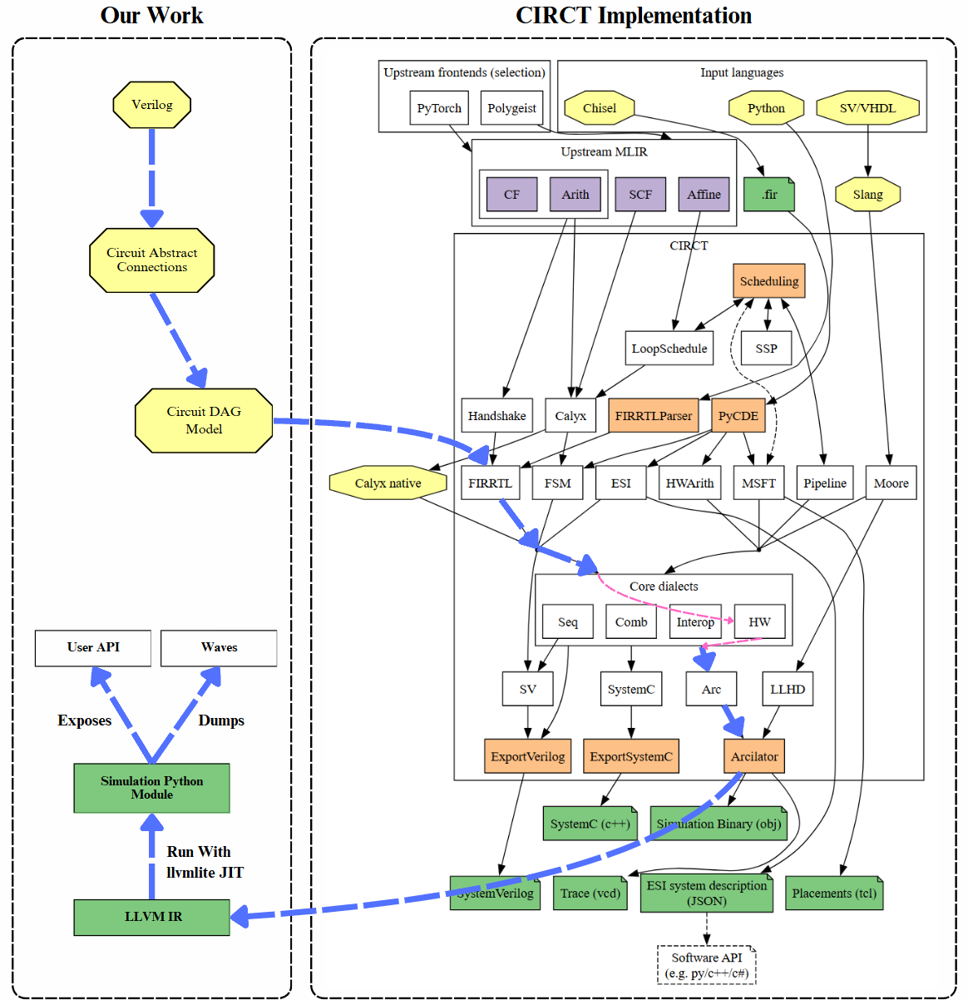

# Veripython: Verilog (subset) frontend and Python testbench generator with CIRCT (LLVM) backend

源语言：Verilog，目标语言：LLVM 与 Python。

Verilog 是一种硬件描述语言（HDL），与传统的通用编程语言（如 C、Python）有本质上的区别：

- 硬件描述：Verilog 用于描述电路而非软件逻辑，它表达的是硬件结构和行为。代码往往包含并行语义，而通用编程语言通常是顺序执行的。
- 时间和时序逻辑：Verilog 使用时钟和时序语句（如 always 块和 @(posedge clk) 等）来描述时序电路的行为。
通用编程语言没有时钟概念，也不会有类似的时序控制语句。
- 并行执行：Verilog 的描述是并行执行的，尤其是多个 always 块和模块实例之间是并发执行的，而传统编程语言往往依赖于函数调用和循环来进行顺序计算。
- 模块化设计：Verilog 有模块（module）这一关键语法结构，用于描述硬件模块，并可以嵌套和实例化模块，这是其主要的结构化特征。而通用编程语言通常使用函数和类来进行模块化。

VeriPython 是一个以 `Python` 为目标语言的 `Verilator` 实现。

Verilator 是一个开源的高性能 Verilog 和 SystemVerilog 模拟器，主要用于将硬件描述语言（HDL）编写的设计转换为可在软件中运行的代码，
从而对硬件设计进行仿真和验证。与传统的硬件仿真工具（比如 ModelSim、VCS 等）不同，Verilator 并不直接进行时序仿真，而是将 Verilog 
或 SystemVerilog 代码转换为 C++ 或 SystemC 代码，然后通过编译生成可执行文件来模拟硬件行为。这样做的好处是，仿真速度非常快，可以在
标准的计算机上运行，而不需要专用的硬件仿真设备。传统的波形工具通常用于查看电路的时序波形，以帮助调试设计中 的信号变化，
而 Verilator 的目标更多是将硬件设计转化为软件可运行的模型，从而快速验证设计的功能是否正确。在许多场景下，Verilator 可以
与其他工具结合使用，进行更详细的时序分析和波形查看，但它本身不生成复杂的波形图，而是侧重于提供高效的仿真性能，适用于大规模的硬件设计验证
和功能验证。

作为编译原理课程的大作业，VeriPython 将实现一个 Verilog Parser（进行词法分析、语法分析）、电路前向传播计算图生成器（语义检查与电路生成）、
MLIR (LLVM) 生成器与 基于 Arcilator (LLVM 子项目 CIRCT 的子项目) 的 Python 后端。为了留出更多时间供我们探索编译原理的核心知识，我们简化了语言支持，
我们只解析了 Verilog 语法的子集，并且只计划支持可综合的代码，也就是 Verilog 的 Initial 等不可综合的代码块是不被支持的，允许我们专注于
Verilog 编译器的核心任务：生成正确的硬件电路，调用 LLVM 基础设施，完成仿真任务，而不是处理复杂的仿真语法。

本项目不仅符合编译原理课程的要求（包括词法分析、语法分析、IR 生成和目标代码生成），还会深入探索硬件描述语言的编译过程，
这对编译器设计的理解具有很好的拓展性和研究价值。它能够结合我们对硬件与编译器的兴趣，展示出我们对这两个领域的交叉应用能力。

小组分工如下：

- 词法分析、测试与电路可视化：杨憬晗
- 语法分析与 AST：徐浩然
- 语义检查与组合逻辑电路生成：杨之凡
- 语法分析、电路生成、时序逻辑与 LLVM：赵涵远



## 编译与运行说明

本项目运行在 Linux 环境。依赖有：

- `cmake` >= 3.22
- `flex`
- `gcc` >= 11

编译步骤如下：
```bash
# 编译，代码路径不能出现中文
$ mkdir build && cd build
# 需要手动下载 CIRCT 发布的依赖库。为了让程序能够四处运行，我们选择了链接静态库
# 下载链接：https://github.com/llvm/circt/releases/download/
# firtool-1.93.1/circt-full-static-linux-x64.tar.gz
# 解压后就是 firtool-1.93.1 目录
$ cmake .. -DCMAKE_BUILD_TYPE=release -DFIRTOOL_LIB_PATH=path/to/firtool-1.93.1/lib
$ make -j

# exe 目录内提供 veripython 的二进制（在 Ubuntu 22.04 下编译），
# 如果测试机器的c库满足条件，或者系统大于22.04，可以直接执行
$ veripython ../tests/verilog_srcs/full_adder.v -o full_adder.json -ast -vis
# 生成 FIRRTL 的中间表示（IR）
$ veripython ../tests/verilog_srcs/mux_test.v -firrtl
# 生成以 Python 模块形式封装好的仿真激励模板文件（Testbench）
$ veripython ../tests/verilog_srcs/birthday.v
```

支持的参数有：

- `-o`：指定输出文件名.

- `-ast`：将语法分析树以`json`格式进行输出.

- `-vis`：使用`graphviz`生成 HDL 的 RTL 视图到 `rtl_view.png`中.

- `-token`：仅生成 `token` 流.

- `-firrtl`：解析 Verilog 源文件，并且以 `FIRRTL` 作为 IR 输出.

- `-hw`：基于已有的 `FIRRTL` 方言的 IR，转换为（Lowering into） `HW` 方言的IR.

- `-llvm`：调用 `CIRCT` 的 `Arcilator`，将表示电路结构的 IR 转换为为可生成通用计算机机器指令的 LLVM IR.

- `-testbench`：生成上述的 LLVM IR，并且封装为调用 `llvmlite` 进行仿真的 Python module，暴露电路的端口以供激励。

## 实现

### 词法分析

为了解析 Verilog 的语法，我们使用了 `flex` （fast lexical analyzer generator，快速词法分析产生器）进行词法分析。
`flex` 应用广泛，从 `linux` 内核、`bash shell` 到 `MySQL` 的 `SQL` 解析器，都有 `flex` 的身影。
`flex` 自带最长匹配与最早匹配原则，非常便于进行一门语言的词法分析。
我们在 `verilog.l` 中定义了词法规则，使用具体的字符串与正则表达式（pcre2 规范）进行 token 的匹配，
一旦匹配到 `token`，就将对应的 `token id` 作为 `yylex` 函数的返回值。这些 `token id` 定义于 `Lexer.h` 中。

根据开发规范，`flex` 生成的 `lex.yy.c` 将在编译时链接到我们的程序中，并通过调用 `yylex` 函数获取下一个 token 的 id。
为了便于在代码中实现前瞻等特性，我还实现了一个 `token buffer`。由 `yylex` 解析出来的 `token` 都会加入 `token buffer` 中，
当 parser 进行前瞻时，直接返回 `token buffer` 的队首，当 parser 进行 eat 时，就 pop 掉队首元素。

### 语法分析

在编写语法分析有关的代码时，尽管已有 ANTLR、bison 等自动语法分析工具可供使用，我们仍然选择了与主流编译器前端相同的策略，也就是
手写递归下降器，这么做的原因如下。

对于电路描述语言，语法规则复杂多变，解析过程往往设计上下文敏感的信息，并且要想让实现具有高效性，就需要在语法分析阶段进行部分的语义检查，
例如在解析非阻塞赋值或者 `assign` 语句时，与其返回一颗语法分析树，不如直接将这一抽象的电路连接加入符号表中。手写递归下降器允许我们处理
一些复杂的语法或者特殊的语言结构，如果使用自动语法分析工具，它们通常要求给出的上下文无关文法非常清晰并且没有歧义，所以我们可能需要手动指定
拓展或者解决冲突，而手写递归下降器允许我们通过回溯或者前瞻更加灵活地处理语法规则。

在处理表达式解析时，相比于定义没有二义性的文法，更为便利的做法是根据运算符优先级进行解析。我们定义了运算符优先级表，根据优先级表，对 `primary`
进行“移入”或者“归约”。`primary` 为表达式中的单元，可以为identifier、常量，也可以为 `5'd3`这样的电路常量，也可以为括号包裹起来的表达式。
我们还修改了 HDL 的运算符优先级解析器，使其支持三元表达式。

```c++
/* 运算符优先级，数值越高越优先 */
std::unordered_map<VeriPythonTokens, int> Parser::operatorPrecedence = {
        {TOKEN_colon,          5},
        {TOKEN_question,       5},
        {TOKEN_logical_and,    20},
        {TOKEN_bitwise_or,     30},
        {TOKEN_bitwise_xor,    40},
        {TOKEN_bitwise_and,    50},
        {TOKEN_cond_eq,        60},
        {TOKEN_cond_ne,        60},
        {TOKEN_cond_lt,        70},
        {TOKEN_cond_le,        70},
        {TOKEN_cond_gt,        70},
        {TOKEN_cond_ge,        70},
        {TOKEN_arith_lshift,   80},
        {TOKEN_logical_lshift, 80},
        {TOKEN_arith_rshift,   80},
        {TOKEN_logical_rshift, 80},
        {TOKEN_op_add,         90},
        {TOKEN_op_sub,         90},
        {TOKEN_op_mod,         100},
        {TOKEN_op_mul,         100},
        {TOKEN_op_div,         100},
        {TOKEN_logical_not,    110},
        {TOKEN_bitwise_not,    110},
};
```

由于 verilog 支持对信号进行切片，例如 `a[3:2]` 就是取 identifier a 的第三根线与第二根线的信号，因此语法分析时也需要对这这一部分解析，
这也再次凸显了递归下降器的优势，只需要前瞻下一个 token 是否为 `[`，如果是，则执行 `parsePortSlicing`，并且将返回值加入电路连接。这一
过程涉及了语法分析也涉及了语义分析。

在设计 AST 时我们充分利用了 C++ 的面向对象特性，在基类中我们定义了虚函数 `toString`。这样只需要执行基类的函数，递归打印子树，
即可输出 AST。在阅读 AST 时，可能会遇到这样的符号：

```json
{
  "nodeType": "identifier__-1_-1",
  "data": "a"
}
```

这里 `identifier__-1_-1` 的 `_-1_-1` 代表的是选中了线束 `a` 的哪几根信号。`_-1_-1` 代表选中所有信号。而

```json
{
  "nodeType": "identifier__3_1",
  "data": "b"
}
```

则代表选中线束 `b` 的第 1 到 3 根信号（从 0 开始）。

### 语义分析与电路生成

在进行语法分析的阶段，我们就已经将电路连接、模块信息等内容加入了符号表内。接下来要做的就是根据电路连接与模块输入输出端口信息生成计算图。该计算图
为一种 DAG （有向无环图），采用事件驱动模型实现了一种前向传播网络。这种数据结构结合了计算图与信号的递归传播特性，十分兼容三态逻辑（0、1和不确定），
十分适用于数字电路模型的描述与仿真。

语法分析在进行解析时，会将解析到的电路连接加入符号表。电路连接是这样一种数据结构，它表示了一组信号的需要传播到的下一个目标，以及这组信号的抽象语法树。
例如
```verilog
assign a = b | c;
```

这一语句对应的电路连接的传播目标就是 `a`，这组信号指的就是 `b | c`。

在语法分析结束后，语义分析将与电路生成同时进行。此时将遍历电路连接。对于上面的例子，`b | c` 对应的 AST 会被递归地解析成电路（计算图）中的组件。例如：

```text
         a
         |
  comb_logic_or__0
 /                \
b                  c
```

`comb_logic_or__0` 就是根据 AST 生成的电路组件，其接受两个输入，并且将它们的信号按位取或。一旦有值从上级前向传播到 `b` 或者 `c`，
`b` 或者 `c` 就会将值继续前向传播到 `comb_logic_or__0`。`comb_logic_or__0` 会保存输入，直到两个输入全都满足后，`comb_logic_or__0`
将计算结果，并且将结果继续传播到 `a`。这里 `comb_logic_or__0` 中的 `__0` 代表的是这是本电路中第 1 个生成的电路组件。

整个电路就是反复地这样操作，将所有抽象的电路连接连接成这样的 DAG，并且可以基于事件驱动模型进行仿真。这一部分的代码位于 `RtlModule.cpp` 的
`RtlModule::buildCircuit` 中。

上面忽略了重要的一点，就是如何将使用 AST 表示的节点转换为 DAG 的电路组件节点。这一过程是通过解析 AST 的 operator 属性完成的。代码
`CombLogics.h` 使用 c++20 的模板功能批量构建了 `CombLogicLogicalOr`（逻辑或） 等能够执行对应计算功能的 `class`，并且编写了一个
工厂函数，根据对应的 operator 属性，生成对应的组合逻辑 `class`。事实上，这里的 operator 就是 `token`。例如有一个 AST：

```text
 token_op_add
/            \
a            b
```

这里，operator 就是 `token_op_add`。`CombLogicFactory::create` 函数会自动根据 `token_op_add`，以 unique_ptr 形式
返回对应的加法器组合逻辑。

### 支持时序逻辑

数字电路的灵魂是时序逻辑，而该功能主要依赖于寄存器的实现。上述文档已经描述了组合逻辑下电路计算图应该如何生成，因此要使我们的电路计算图
支持时序逻辑，只需要正确处理计算图中的寄存器节点即可。

```text
       |
  +---------+
  |   CLK   |
--| D     Q |--
  |   RST   |
  +---------+
       |
```

1. 寄存器需要支持敏感列表，也就是实现clock信号的处理。前端会解析这个寄存器的触发边沿。寄存器在时钟上升/下降沿到来前会一直输出它之前采样到的数据。
并且在计算图中，当时钟信号变化时，才对寄存器的输入采样，并且将采样到的数据作为之后的输出。

2. 在我们的模型下，我们的寄存器仅支持同步复位。同步复位指的是，当 CLK 信号到达上升/下降沿时，寄存器对 RST 进行采样。如果 RST 为 active 
的信号，那么就对复位值进行采样，将其作为之后的输出。

3. 在电路中，组合逻辑的回环是被禁止的，但是寄存器的输入输出端口是可以回环的，所以此时这张图变成了一张有向有环图。但是我们通过一些特殊的处理，
例如只在最后对寄存器的输出进行前向传播，实际上还是实现了一个DAG，用于输出信号的计算。

所以我们利用了面向对象的思想，让寄存器继承了普通的导线，但是重写了前向传播与节点绑定的函数，就实现了时序逻辑。

### 利用 LLVM 框架的 MLIR 子项目生成 FIRRTL 中间表示

LLVM 的 MLIR（Multi-Level Intermediate Representation）是一个通用的编译框架，通过支持多层次的中间表示来简化和优化编译器设计。
MLIR 提供了灵活的基础设施，可以自定义领域特定的中间表示（DSL IR）以及在多层抽象间进行转换和优化。
这种灵活性使其非常适合硬件设计与验证领域中的复杂场景，如处理硬件描述语言和硬件专用优化。

CIRCT 是基于 MLIR 的项目，专为硬件描述设计服务，提供了对 FIRRTL 等硬件相关中间表示的支持。
FIRRTL（Flexible Intermediate Representation for RTL）是一种中间表示（IR），专为数字硬件设计领域创建，是 MLIR 的一种方言，
用于描述 RTL（寄存器传输级）电路。它是 Chisel（一种基于 Scala 的硬件描述语言）的核心组件之一，通过提供对硬件结构的灵活描述和分析能力，
支持从高层设计到低层 Verilog 的转换和优化。FIRRTL 的设计注重硬件特性，例如时序逻辑、组合逻辑和特定的硬件约束。

要利用 MLIR 与 CIRCT 生成 FIRRTL 表示，需要结合 MLIR、CIRCT 提供的基础设施与 FIRRTL 的方言特性。在 CIRCT 的支持下，
我们的代码通过 `circt::firrtl` 命名空间提供的类和操作符完成对电路结构的描述与生成。
关键部分包括使用 `circt::firrtl::CircuitOp` 和 `circt::firrtl::FModuleOp` 创建电路的层次化结构，
前者表示整个电路的顶层容器，后者用于定义模块及其端口信息。端口定义中，`circt::firrtl::PortInfo` 被用来存储端口名、方向、类型等元信息，
并通过 `circt::firrtl::UIntType` 等类型系统实现对位宽的精确描述。对于具体的电路操作，代码通过 FIRRTL 提供的原语操作符，
例如 `circt::firrtl::MuxPrimOp` 用于多路复用器，`circt::firrtl::ConstantOp` 用于常量值，
以及 `circt::firrtl::BitsPrimOp` 实现对位选的支持。这些操作符不仅描述了硬件逻辑，同时通过类型推导函数
（如 `MuxPrimOp::inferReturnType` 和 `BitsPrimOp::inferReturnType`）确保了类型系统的安全性。

在符号管理方面，代码依赖符号表 `symbolTable` 维护 FIRRTL 操作与高层电路符号的映射，避免重复生成操作，
同时通过 `circt::firrtl::emitConnect` 实现符号间的信号连接。MLIR 的构建器 `circt::OpBuilder` 和 `mlir::ImplicitLocOpBuilder`
被用于管理操作的插入点和生成上下文，结合 `mlir::APInt` 和 `mlir::IntegerAttr` 等 LLVM 中的基础数据结构， 支持常量和属性的定义。

利用 LLVM 的基础设施，我们的程序不仅能高效地生成符合硬件设计规范的中间表示，还能提供强大的分析和优化能力，
MLIR 的基础设施可以对生成的 FIRRTL 进行硬件级优化，例如消除冗余逻辑、优化时序路径等。最后，使用 LLVM 等基础设施提供的转换能力，
可以将 FIRRTL 表示进一步转换为 Verilog 或其他后端格式，以支持硬件综合和仿真。

### 调用 Arcilator 作为后端，生成硬件仿真代码

Arcilator 是一个基于 **CIRCT** 框架开发的硬件仿真工具，旨在提供快速且周期准确的 RTL（寄存器传输级）硬件仿真。
CIRCT（Circuit IR Compilers and Tools）是一个基于 **LLVM** 基础设施的开源框架，专注于硬件设计的高效表示和优化。
Arcilator 利用了 CIRCT 提供的硬件特定中间表示（如 HW 和 Comb 方言）以及 LLVM 的优化和代码生成能力，
将硬件描述从 CIRCT 的 IR 转化为 LLVM IR，再通过 LLVM 的编译工具链生成高效的仿真器代码。

Arcilator 结合了 CIRCT 的硬件建模能力和 LLVM 的优化能力，因此我们选择以 Arcilator 作为编译器的后端。要将我们的电路结构转换为
Arcilator 能够识别的 `Arc` 方言，首先需要将电路转换为 `FIRRTL` 表示，再利用管线 `populateLowFIRRTLToHW` 将 `FIRRTL` 转换为
`HW` 方言表示。接着需要进行 `populateHwModuleToArcPipeline` 管线，该管线转换端口类型、转换电路状态并且时不时进行一些冗余优化，
最终生成了 `Arc` 表示。再使用以 `createLowerArcToLLVMPass` 为主的 Pass 将 `Arc` 表示 "Lowering into" LLVM IR。此时我们就
得到了硬件仿真代码。这一流程可以在图1中完全体现。

例如如下的 verilog 代码：

```verilog
module mux_2to1(
    input [2:0] a,
    input [3:0] b,
    input [1:0] sel,
    output [2:0] out
);
    assign out = sel[0] ? b[3:1] : (sel[1] ? a : 3'd2);
endmodule
```

生成的 `FIRRTL` 表示：

```asm
module {
  firrtl.circuit "mux_2to1" {
    firrtl.module @mux_2to1(in %a: !firrtl.uint<3>, in %b: !firrtl.uint<4>, 
    in %sel: !firrtl.uint<2>, out %out: !firrtl.uint<3>) {
      %0 = firrtl.bits %sel 0 to 0 : (!firrtl.uint<2>) -> !firrtl.uint<1>
      %_sel__0 = firrtl.node interesting_name %0 : !firrtl.uint<1>
      %1 = firrtl.bits %b 3 to 1 : (!firrtl.uint<4>) -> !firrtl.uint<3>
      %_b__1 = firrtl.node interesting_name %1 : !firrtl.uint<3>
      %2 = firrtl.bits %sel 1 to 1 : (!firrtl.uint<2>) -> !firrtl.uint<1>
      %_sel__2 = firrtl.node interesting_name %2 : !firrtl.uint<1>
      %c2_ui3 = firrtl.constant 2 : !firrtl.const.uint<3>
      %3 = firrtl.mux(%_sel__2, %a, %c2_ui3) : (!firrtl.uint<1>, !firrtl.uint<3>, 
      !firrtl.const.uint<3>) -> !firrtl.uint<3>
      %4 = firrtl.mux(%_sel__0, %_b__1, %3) : (!firrtl.uint<1>, !firrtl.uint<3>, 
      !firrtl.uint<3>) -> !firrtl.uint<3>
      %5 = firrtl.bits %4 2 to 0 : (!firrtl.uint<3>) -> !firrtl.uint<3>
      %___comb_multiplexer__0__3 = firrtl.node interesting_name %5 : !firrtl.uint<3>
      firrtl.matchingconnect %out, %___comb_multiplexer__0__3 : !firrtl.uint<3>
    }
  }
}
```

生成的 `HW` 方言：

```asm
module {
  hw.module @mux_2to1(in %a : i3, in %b : i4, in %sel : i2, out out : i3) {
    %c2_i3 = hw.constant 2 : i3
    %0 = comb.extract %sel from 0 {sv.namehint = "_sel__0"} : (i2) -> i1
    %1 = comb.extract %b from 1 {sv.namehint = "_b__1"} : (i4) -> i3
    %2 = comb.extract %sel from 1 {sv.namehint = "_sel__2"} : (i2) -> i1
    %3 = comb.mux bin %2, %a, %c2_i3 : i3
    %4 = comb.mux bin %0, %1, %3 {sv.namehint = "___comb_multiplexer__0__3"} : i3
    hw.output %4 : i3
  }
  om.class @mux_2to1_Class(%basepath: !om.basepath) {
    om.class.fields
  }
}
```

最终会生成如下用于硬件仿真的 LLVM IR：

```asm
define void @mux_2to1_eval(ptr %0) {
  %2 = getelementptr i8, ptr %0, i32 2
  %3 = load i2, ptr %2, align 1
  %4 = getelementptr i8, ptr %0, i32 1
  %5 = load i4, ptr %4, align 1
  %6 = load i3, ptr %0, align 1
  %7 = trunc i2 %3 to i1
  %8 = lshr i4 %5, 1
  %9 = trunc i4 %8 to i3
  %10 = lshr i2 %3, 1
  %11 = trunc i2 %10 to i1
  %12 = select i1 %11, i3 %6, i3 2
  %13 = select i1 %7, i3 %9, i3 %12
  %14 = getelementptr i8, ptr %0, i32 3
  store i3 %13, ptr %14, align 1
  ret void
}
```

这个 `mux_2to1_eval` 函数的参数，为一个指向连续内存的指针，对应着电路内的状态。每次执行这个函数，都会根据输入改变输出，并且将结果写回
这片连续内存内。

### 封装为 Python Testbench Module

Arcilator 提供了上述的连续内存的布局信息，我们利用元编程的思想，生成了一个可以操作上述状态的 Python 模块。该模块导入了 `llvmlite` 包，
使用 JIT 的方式加速 LLVM IR 的执行。生成这个 Python 模块时，在代码中硬编码了内存布局信息，使用 `ctypes` 操作这片内存，并且向用户
封装这一过程。该模块还导入了 `pyvcd` 包，在仿真时还支持导出波形文件，可以使用其它工具进行查看，更加利于调试。

完整代码太过冗长。这里不做展示。如果用户使用我们的模块进行仿真调试，只需要如下几行代码：

```python
# mux_2to1_pytb 模块为我们的项目生成的模块
from mux_2to1_pytb import mux_2to1

if __name__ == "__main__":
  # dut: device under test
  dut = mux_2to1(True) # True 意味着记录波形，仿真结束后，生成波形文件
  # 利用类似 chisel 的 poke 和 peek 接口，控制端口信号
  dut.view.a.poke(4)
  dut.view.b.poke(5)
  dut.view.sel.poke(2)
  # 设置好输入信号后，执行 LLVM IR 求值
  dut.eval()
  # 利用高级语言特性，方便地进行输出与调试
  print(dut.view.out.peek())
  # 断言输出是否与期待的一致
  assert dut.view.out.peek() == 4

  # 重复实验
  dut.view.a.poke(5)
  dut.view.b.poke(7)
  dut.view.sel.poke(1)
  dut.eval()
  print(dut.view.out.peek())
  assert dut.view.out.peek() == 3

  # 重复实验
  dut.view.a.poke(5)
  dut.view.b.poke(7)
  dut.view.sel.poke(0)
  dut.eval()
  print(dut.view.out.peek())
  assert dut.view.out.peek() == 2
```

## 运行结果

### 前端部分


电路源代码：

```verilog
module counter (
    input wire clk,
    input wire rst_n,
    output [7:0] count
);

reg [7:0] counter_reg;
reg [7:0] aux_counter_reg;
assign count = counter_reg;

always @(posedge clk) begin
    if (!rst_n) begin
        counter_reg <= 8'd0;
        aux_counter_reg <= 8'd0;
    end
    else begin
        counter_reg <= counter_reg + 8'd1;
        aux_counter_reg <= aux_counter_reg;
        if (counter_reg[0] == 1'd1) begin
            aux_counter_reg <= aux_counter_reg + 1;
        end
    end
end

endmodule
```

生成的 RTL 视图如图2所示。手动重绘后的视图如图3所示。

可以观察到，我们的前端正常工作，正确解析了 verilog 源代码，并且正确生成了复用器（Multiplexer）、非门、加法器、比较器（全部相等）、
寄存器、输入输出端口等电路组件，成功生成了 DAG 图。我们项目内部自带了一个基于 DAG 的前向传播仿真器，仿真器的结果正确，
集成了 gtest 框架，能够通过 CI 测试。

### 后端部分

为了测试后端运行结果，我们引入了本科数字电路课程中的一个实验模块：生日密码锁。该密码锁有10个按键，主要模型为 Moore 有限状态机，
用户按键后，只要最近一次按键为密码 `919`，就进入开锁状态，否则关锁。该代码文件名为 `birthday.v`。

该测例主要测试前端的解析功能，尤其是表达式中的三元运算符、线束连接和 `if-else` 块的处理和电路结构的生成。该测例也覆盖了后端的
状态管理、硬件仿真等功能，可以验证我们项目实现的正确性。该模块生成的 RTL 视图如图4所示。根据此图也可以看出，该电路结构十分复杂，
符合我们的测试要求。


在生成了 Python 仿真激励模块后，我们编写如下的仿真激励代码：

```Python
from birthday_locker_tb import birthday_locker

if __name__ == "__main__":
  # dut: device under test
  dut = birthday_locker(True)

  # 模块采用 one-hot 编码，这里进行转换，体现了高级语言的优越性
  def digitToOneHot(digit):
    assert (0 <= digit <= 9)
    return 2 ** digit


  # 在时钟采样前设置好用户的按键输入
  def doInputPerClock(digit):
    dut.view.clk.poke(0)
    dut.view.key.poke(digitToOneHot(digit))
    dut.eval()

    dut.view.clk.poke(1)
    dut.eval()


  # 复位
  dut.view.key.poke(0)
  dut.view.rst_n.poke(0)
  dut.view.clk.poke(0)
  dut.eval()
  dut.view.clk.poke(1)
  dut.eval()

  # 复位结束，电路开始工作
  dut.view.rst_n.poke(1)

  # 输入一串数字，观察什么时候开锁
  doInputPerClock(8)
  doInputPerClock(9)
  doInputPerClock(1)
  doInputPerClock(9) # 此时应该开锁，状态应该显示 UNLOCKED
  doInputPerClock(9) # 关锁
  doInputPerClock(1)
  doInputPerClock(9) # 又开锁

  # 用户松手
  dut.view.key.poke(0)

  # 继续仿真几个周期，开锁状态应该保持
  # ...
```

仿真结束后，我们得到了仿真波形。使用 `gtkwave` 查看波形，波形如图 5 所示。该波形成功对应了我们的仿真激励，验证了我们实现的正确性。


## 总结

我们的项目的 feature 有：

1. 选择电路描述语言 Verilog

2. 手写递归下降器，实现 Verilog 文法子集解析，支持 always 块

3. 将源代码抽象为电路符号之间的连接，进一步转换为 DAG，可进行前向传播并仿真

4. 集成 gtest 框架，利用 DAG 进行电路功能测试

5. 使用 LLVM 基础设施，利用子项目 CIRCT 的方言作为中间表示，并调用多个管线，生成目标代码

6. 提供了基于 Python 的仿真测试文件，使用 JIT 加速 LLVM IR 执行，并且提供仿真波形数据。

7. 在项目的开发过程中，给 circt 提出了一个 Pull Request 并被合并。
